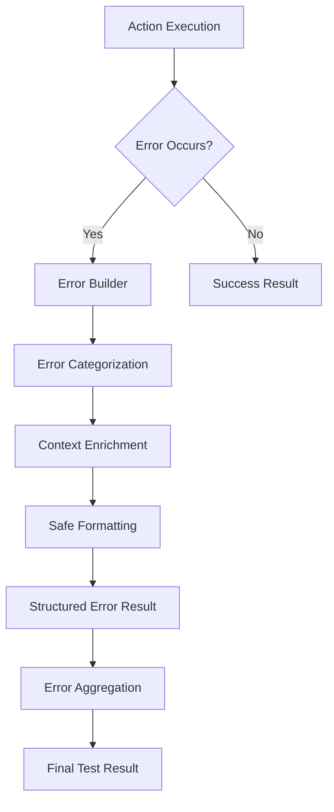
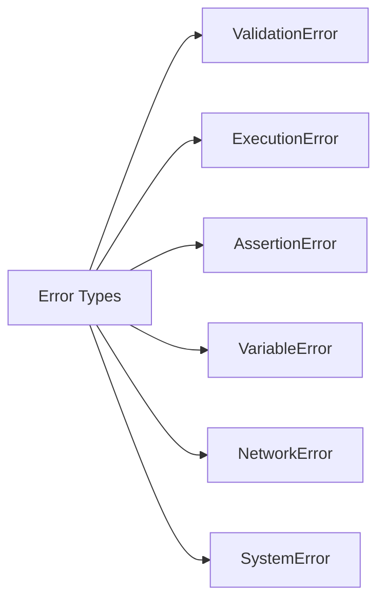

# Design Document

## Overview

This design enhances Robogo's error handling system by introducing a centralized error management framework, structured error types, secure formatting mechanisms, and enhanced debugging capabilities. The solution completely replaces the existing error handling system to provide significantly improved error reporting and debugging experience.

## Architecture

### Error Handling Flow



### Error Classification System



## Components and Interfaces

### 1. Enhanced Error Types

**ErrorCategory Enumeration:**
```go
type ErrorCategory string

const (
    ErrorCategoryValidation ErrorCategory = "validation"
    ErrorCategoryExecution  ErrorCategory = "execution"
    ErrorCategoryAssertion  ErrorCategory = "assertion"
    ErrorCategoryVariable   ErrorCategory = "variable"
    ErrorCategoryNetwork    ErrorCategory = "network"
    ErrorCategorySystem     ErrorCategory = "system"
)
```

**Structured Error Information:**
```go
type ErrorInfo struct {
    Category    ErrorCategory          `json:"category"`
    Code        string                 `json:"code"`
    Message     string                 `json:"message"`
    Context     map[string]interface{} `json:"context,omitempty"`
    Suggestions []string               `json:"suggestions,omitempty"`
    Timestamp   time.Time              `json:"timestamp"`
}
```

**Enhanced ActionResult:**
```go
type ActionResult struct {
    Status    ActionStatus `json:"status"`
    ErrorInfo *ErrorInfo   `json:"error_info,omitempty"`
    Data      any          `json:"data,omitempty"`
    Meta      any          `json:"meta,omitempty"`
}
```

### 2. Error Builder System

**ErrorBuilder Interface:**
```go
type ErrorBuilder struct {
    category    ErrorCategory
    code        string
    template    string
    context     map[string]interface{}
    suggestions []string
}

func NewErrorBuilder(category ErrorCategory, code string) *ErrorBuilder
func (eb *ErrorBuilder) WithTemplate(template string) *ErrorBuilder
func (eb *ErrorBuilder) WithContext(key string, value interface{}) *ErrorBuilder
func (eb *ErrorBuilder) WithSuggestion(suggestion string) *ErrorBuilder
func (eb *ErrorBuilder) Build(args ...interface{}) ActionResult
```

**Safe Formatting System:**
```go
type SafeFormatter struct {
    templates map[string]string
}

func (sf *SafeFormatter) Format(template string, args ...interface{}) (string, error)
func (sf *SafeFormatter) RegisterTemplate(name, template string)
```

### 3. Enhanced Assertion System

**Assertion Context:**
```go
type AssertionContext struct {
    Actual       interface{} `json:"actual"`
    Expected     interface{} `json:"expected"`
    Operator     string      `json:"operator"`
    ActualType   string      `json:"actual_type"`
    ExpectedType string      `json:"expected_type"`
    ComparisonType string    `json:"comparison_type"` // "numeric", "string", "boolean"
}
```

**Assertion Result Builder:**
```go
func NewAssertionError(ctx AssertionContext) ActionResult
func NewAssertionSuccess() ActionResult
```

### 4. Variable Resolution Enhancement

**Variable Context Tracking:**
```go
type VariableContext struct {
    Template     string                 `json:"template"`
    Expression   string                 `json:"expression"`
    Variables    map[string]interface{} `json:"available_variables"`
    AccessPath   []string               `json:"access_path,omitempty"`
    FailurePoint string                 `json:"failure_point,omitempty"`
}
```

**Enhanced Variable Substitution:**
```go
func (v *Variables) SubstituteWithContext(template string) (string, *VariableContext, error)
func (v *Variables) GetResolutionTrace(expression string) []string
```

## Data Models

### Error Templates

**Predefined Error Templates:**
```go
var ErrorTemplates = map[string]string{
    "assertion.failed":           "Assertion failed: expected %v %s %v, but got %v",
    "assertion.type_mismatch":    "Type mismatch in assertion: expected %s but got %s",
    "variable.unresolved":        "Variable '%s' could not be resolved in template '%s'",
    "variable.invalid_access":    "Invalid access path '%s' in variable '%s'",
    "action.invalid_args":        "Action '%s' received invalid arguments: %s",
    "action.execution_failed":    "Action '%s' execution failed: %s",
    "http.request_failed":        "HTTP request failed: %s %s returned %d",
    "database.connection_failed": "Database connection failed: %s",
}
```

### Context Enrichment

**Step Context Information:**
```go
type StepContext struct {
    StepNumber   int                    `json:"step_number"`
    StepName     string                 `json:"step_name"`
    ActionName   string                 `json:"action_name"`
    LoopContext  *LoopContext          `json:"loop_context,omitempty"`
    Variables    map[string]interface{} `json:"variables,omitempty"`
}

type LoopContext struct {
    Type      string `json:"type"`      // "for", "while"
    Iteration int    `json:"iteration"`
    Index     int    `json:"index,omitempty"`
    Item      interface{} `json:"item,omitempty"`
}
```

## Error Handling

### Centralized Error Creation

**Error Factory:**
```go
type ErrorFactory struct {
    formatter *SafeFormatter
    templates map[string]string
}

func (ef *ErrorFactory) CreateValidationError(code, template string, args ...interface{}) ActionResult
func (ef *ErrorFactory) CreateAssertionError(ctx AssertionContext) ActionResult
func (ef *ErrorFactory) CreateVariableError(ctx VariableContext) ActionResult
func (ef *ErrorFactory) CreateExecutionError(action, message string) ActionResult
```

### Error Aggregation

**Error Collector:**
```go
type ErrorCollector struct {
    errors []ErrorInfo
    warnings []string
}

func (ec *ErrorCollector) AddError(err ErrorInfo)
func (ec *ErrorCollector) AddWarning(warning string)
func (ec *ErrorCollector) GetSummary() ErrorSummary
```

### Security Measures

**Format String Validation:**
- All error templates are predefined and validated at startup
- User input is never used directly as format strings
- Dynamic content is properly escaped before inclusion
- Template parameters are type-checked where possible

## Testing Strategy

### Unit Testing

**Error Builder Testing:**
- Test all error categories and codes
- Verify safe formatting with various input types
- Test context enrichment functionality
- Validate template parameter substitution

**Assertion Enhancement Testing:**
- Test enhanced assertion failure reporting
- Verify type detection and comparison logic
- Test numeric vs string comparison reporting
- Validate loop context inclusion

**Variable Resolution Testing:**
- Test variable resolution tracing
- Verify error context generation
- Test nested access path reporting
- Validate expression evaluation error handling

### Integration Testing

**End-to-End Error Flow:**
- Test error propagation through the execution pipeline
- Verify error aggregation across multiple steps
- Test error context preservation in loops
- Validate final error reporting format

**Action Integration:**
- Test error handling in all existing actions
- Verify consistent error formatting across actions
- Test complete replacement of old error handling
- Validate new error information availability

### Security Testing

**Format String Security:**
- Test with malicious format string inputs
- Verify user input sanitization
- Test template injection prevention
- Validate compile-time format string validation

## Implementation Notes

### Migration Strategy

1. **Phase 1:** Implement core error handling infrastructure
2. **Phase 2:** Replace assertion system with new error handling
3. **Phase 3:** Enhance variable resolution with better error reporting
4. **Phase 4:** Update all actions to use centralized error system
5. **Phase 5:** Add structured error output and debugging features

### Breaking Changes

- Error message formats will change to be more consistent and informative
- Error result structures will include additional fields
- Some error codes and categories will be standardized
- Old error handling methods will be completely replaced

### Performance Considerations

- Error context collection is lazy-loaded
- Template compilation happens at startup
- Error aggregation uses efficient data structures
- Debug information collection can be disabled in production