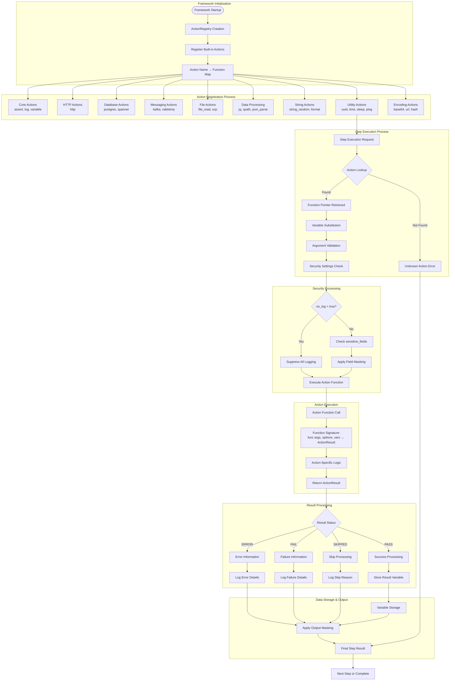

# Action System Architecture

This diagram shows how the action system works in Robogo - from action registration to execution and result processing. The action system is the heart of the framework, providing 24+ built-in actions with a consistent interface pattern.

## Action System Flow



## Action Function Signature

All actions follow a consistent function signature pattern:

```go
func actionName(args []any, options map[string]any, vars *common.Variables) types.ActionResult
```

**Parameters:**
- **`args []any`** - Positional arguments from YAML `args` array
- **`options map[string]any`** - Named options from YAML `options` map
- **`vars *common.Variables`** - Variable storage for substitution and result storage

**Return:**
- **`types.ActionResult`** - Standardized result with status, data, and error information

## Action Categories & Examples

### **Core Actions (3)**
Essential framework operations:
```yaml
# Assert - Test validation
- action: assert
  args: ["${status_code}", "==", "200"]

# Log - Output messages
- action: log
  args: ["Test completed successfully"]

# Variable - Variable manipulation  
- action: variable
  args: ["set", "test_mode", "true"]
```

### **HTTP Actions (1)**
HTTP client operations:
```yaml
# HTTP - All methods supported
- action: http
  args: ["POST", "${api_url}/users", '{"name": "Alice"}']
  options:
    timeout: "30s"
    headers:
      Content-Type: "application/json"
  result: response
```

### **Database Actions (2)**
Database operations:
```yaml
# PostgreSQL
- action: postgres
  args: ["query", "${db_url}", "SELECT * FROM users"]
  result: users

# Google Cloud Spanner
- action: spanner
  args: ["query", "${spanner_db}", "SELECT UserId, Name FROM Users"]
  result: spanner_users
```

### **Messaging Actions (3)**
Message queue operations:
```yaml
# Kafka
- action: kafka
  args: ["list_topics", "localhost:9092"]
  result: topics

# RabbitMQ
- action: rabbitmq
  args: ["publish", "amqp://localhost", "test-queue", "Hello World"]

# SWIFT Financial Messaging
- action: swift_message
  args: ["MT103", "${payment_data}"]
  result: swift_msg
```

### **File Actions (2)**
File system operations:
```yaml
# File Reading
- action: file_read
  args: ["/path/to/data.json"]
  result: file_content

# Secure Copy (SCP)
- action: scp
  args: ["upload", "user@host:/remote/path", "/local/file"]
  options:
    password: "${ENV:SSH_PASSWORD}"
```

### **Data Processing Actions (4)**
Data parsing and manipulation:
```yaml
# JSON Query with jq
- action: jq
  args: ["${response}", ".data.users[0].id"]
  result: user_id

# XML Processing
- action: xpath
  args: ["${xml_data}", "//user[@id='123']/name/text()"]
  result: username

# JSON Construction
- action: json_build
  args: [{"user": "${user_name}", "id": "${user_id}"}]
  result: user_object
```

### **String Actions (4)**
String manipulation and generation:
```yaml
# Random String Generation
- action: string_random
  args: [16]
  options:
    charset: "alphanumeric"
  result: random_id

# String Formatting
- action: string_format
  args: ["User: ${name}, ID: ${id}", {"name": "Alice", "id": 123}]
  result: formatted_string
```

### **Encoding Actions (5)**
Encoding and hashing operations:
```yaml
# Base64 Encoding
- action: base64_encode
  args: ["Hello World"]
  result: encoded_string

# URL Encoding
- action: url_encode
  args: ["hello world@example.com"]
  result: url_safe_string

# Cryptographic Hashing
- action: hash
  args: ["sha256", "password123"]
  result: password_hash
```

### **Utility Actions (4)**
General-purpose utilities:
```yaml
# UUID Generation
- action: uuid
  result: unique_id

# Time Operations
- action: time
  args: ["now", "2006-01-02 15:04:05"]
  result: timestamp

# Sleep/Delay
- action: sleep
  args: ["2s"]

# Network Ping
- action: ping
  args: ["google.com"]
  options:
    count: 3
    timeout: "5s"
  result: ping_stats
```

## Action Registration Process

### **Built-in Registration**
Actions are registered during framework initialization:

```go
func (registry *ActionRegistry) registerBuiltinActions() {
    // Core actions
    registry.Register("assert", assertAction)
    registry.Register("log", logAction)
    registry.Register("variable", variableAction)
    
    // HTTP actions
    registry.Register("http", httpAction)
    
    // Database actions
    registry.Register("postgres", postgresAction)
    registry.Register("spanner", spannerAction)
    
    // ... all 24 actions registered
}
```

### **Action Lookup**
Fast O(1) lookup using Go map:

```go
func (registry *ActionRegistry) Get(actionName string) (ActionFunction, bool) {
    action, exists := registry.actions[actionName]
    return action, exists
}
```

## Security Integration

### **Step-Level Security**
Security controls applied before action execution:

```yaml
# Complete logging suppression
- name: "Sensitive operation"
  action: http
  args: ["POST", "/auth", '{"password": "${secret}"}']
  no_log: true

# Custom field masking
- name: "Process payment"
  action: http
  args: ["POST", "/payment", "${payment_data}"]
  sensitive_fields: ["credit_card", "cvv"]
```

### **Automatic Pattern Detection**
Built-in sensitive pattern detection:
- `password=`, `token=`, `api_key=`, `secret=`
- `Authorization: Bearer`, `X-API-Key:`
- Credit card patterns, SSN patterns

## Error Handling Architecture

### **Standardized Result Types**
All actions return consistent result structure:

```go
type ActionResult struct {
    Status      ActionStatus  `json:"status"`           // PASS, FAIL, ERROR, SKIPPED
    Data        any          `json:"data,omitempty"`   // Action-specific result
    ErrorInfo   *ErrorInfo   `json:"error_info,omitempty"`   // Technical problems
    FailureInfo *FailureInfo `json:"failure_info,omitempty"` // Logical test problems
}
```

### **Error Classification**
- **ErrorInfo**: Technical problems (network, database, system issues)
- **FailureInfo**: Logical problems (assertions, validation, business logic)

## Performance Characteristics

### **Registration Performance**
- **O(1) Action Lookup**: Fast map-based action resolution
- **Compile-Time Registration**: All actions registered at startup
- **No Runtime Discovery**: No reflection or dynamic loading overhead

### **Execution Performance**
- **Direct Function Calls**: No interface overhead or reflection
- **Minimal Allocation**: Reuse of result structures where possible
- **Efficient Variable Substitution**: Simple string replacement

### **Memory Usage**
- **Small Function Footprint**: Actions are simple functions, not objects
- **Shared Registry**: Single registry instance across all test runs
- **Result Object Reuse**: Where possible, results are reused

## Extension Points

### **Adding New Actions**
1. **Implement Function**: Follow the standard signature pattern
2. **Register Action**: Add to `registerBuiltinActions()` 
3. **Add Constants**: Define operation constants if needed
4. **Create Examples**: Add test examples demonstrating usage

### **Custom Action Categories**
Actions can be logically grouped by:
- **Domain**: HTTP, Database, Messaging, etc.
- **Purpose**: Validation, Data Processing, Utilities, etc.
- **Complexity**: Simple operations vs. complex workflows

This action system provides the foundation for Robogo's extensibility while maintaining simplicity and consistent patterns across all 24+ built-in actions.