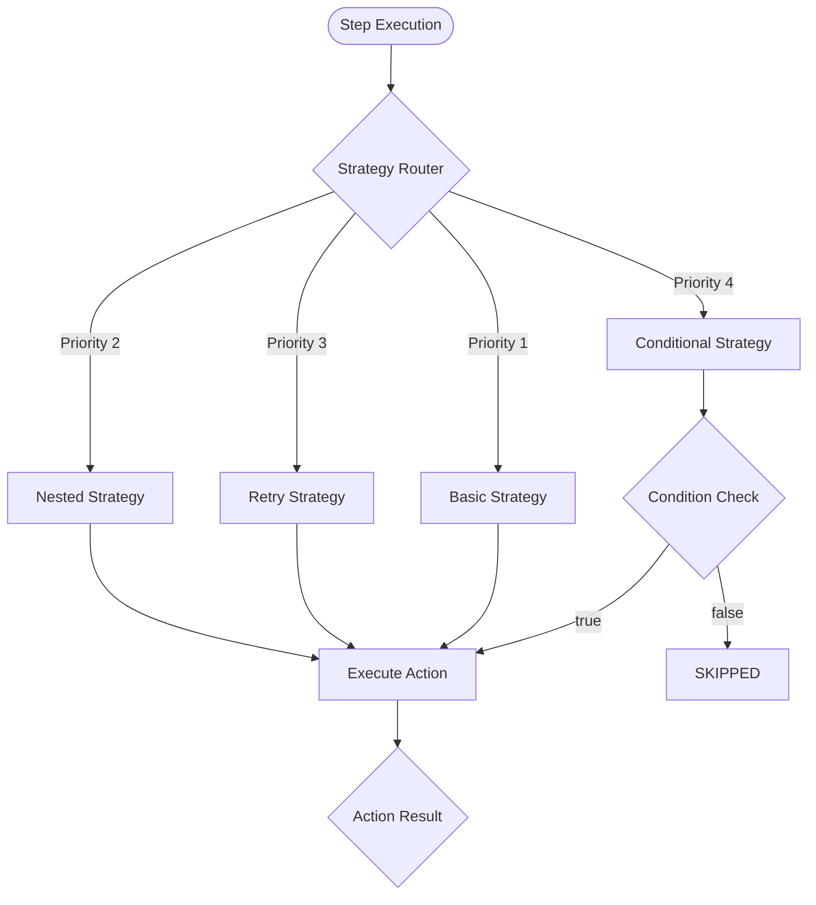
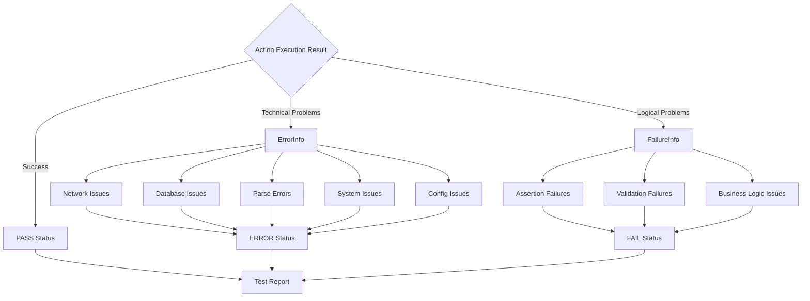
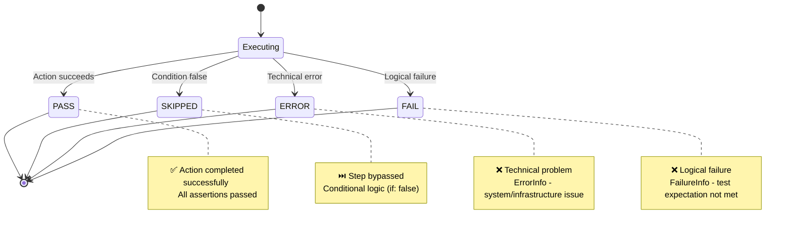

# Robogo Error & Failure States Diagram

This diagram explains Robogo's execution flow and the distinction between errors, failures, and various step states.

## Execution Strategy Flow

## Error vs Failure Classification

## Step Status Outcomes

## Key Concepts Explained

### 1. **Execution Strategy Priority System**
- **Priority 4**: Conditional logic (`if` statements) - highest priority for control flow
- **Priority 3**: Retry logic - handles retry configurations with backoff
- **Priority 2**: Nested steps - manages step collections and sub-workflows  
- **Priority 1**: Basic execution - fallback for standard action execution

### 2. **Dual Error Classification System**

#### **ErrorInfo (Technical Problems)**
These prevent proper execution and indicate infrastructure or configuration issues:
- **Network Issues**: Connection timeouts, DNS failures, unreachable services
- **Database Issues**: Invalid credentials, server downtime, malformed connection strings
- **Parse/Serialization**: Malformed JSON/XML, invalid data formats
- **System Issues**: File permissions, missing resources, OS-level problems
- **Configuration**: Missing parameters, invalid URLs, bad authentication

#### **FailureInfo (Logical Problems)**
These indicate the system worked but produced unexpected results:
- **Assertion Failures**: Expected vs actual value mismatches
- **Validation Failures**: Response format issues, missing fields, schema violations
- **Business Logic**: User conflicts, permission issues, data integrity problems

### 3. **Step Status Outcomes**

| Status | Meaning | When It Occurs |
|--------|---------|----------------|
| **PASS** | ✅ Success | Action completed successfully, all assertions passed |
| **SKIPPED** | ⏭️ Bypassed | Conditional logic (`if: false`) caused step to be skipped |
| **ERROR** | ❌ Technical Problem | Infrastructure/system issues (ErrorInfo) occurred |
| **FAIL** | ❌ Logical Problem | Test expectations not met (FailureInfo) occurred |

### 4. **Unified Result Access**
Despite the internal distinction between `ErrorInfo` and `FailureInfo`, both are accessible through:
- `result.GetMessage()` - Returns human-readable error or failure message
- `result.HasIssue()` - Returns true for either errors or failures
- Final test reports treat both as failures for execution flow control

### 5. **Design Benefits**
- **Clear Problem Classification**: Separates "system broken" from "test failed"
- **Targeted Debugging**: Technical errors suggest infrastructure fixes, failures suggest code issues
- **Consistent Interface**: Unified access pattern despite internal complexity
- **Comprehensive Coverage**: All execution paths lead to meaningful status reporting

This dual-classification system enables Robogo to provide precise feedback while maintaining a simple interface for test authors.