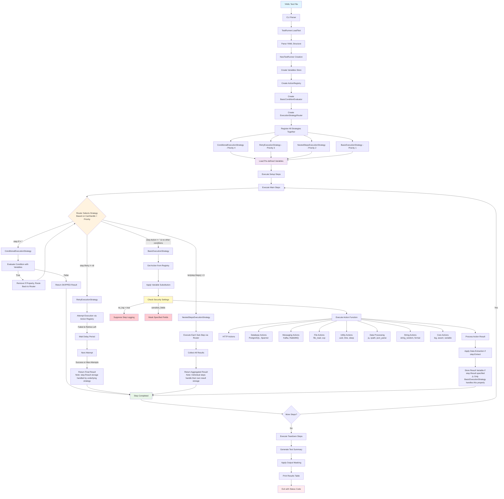

# Robogo Test Execution Flow

This diagram shows how a test case flows through the current Robogo framework architecture.

## Current Architecture Highlights

**Strategy Pattern (Priority-Based Routing):**
- **Conditional** → **Retry** → **NestedSteps** → **Basic**
- Each strategy handles its specific concern and delegates to the next

**Security-Aware Execution:**
- `no_log` suppresses step logging for sensitive operations
- `sensitive_fields` masks specific data in logs and output
- Automatic masking of passwords, tokens, API keys

**Action System:**
- **27+ Built-in Actions** across 8 categories
- **SCP Action** for secure file transfers via SSH/SFTP
- **Direct Function Calls** - no interfaces or abstractions

**Variable System:**
- Simple `${variable}` and `${ENV:VARIABLE}` substitution  
- No complex templating engines or dependency injection
- Variables resolved before action execution

**Key Simplifications:**
- Removed VariableManager, TemplateSubstitution layers
- Eliminated dependency injection system
- Direct construction throughout
- Single Variables struct instead of 4-layer abstraction

This reflects the current clean, KISS-principle architecture with comprehensive SCP support and security features.