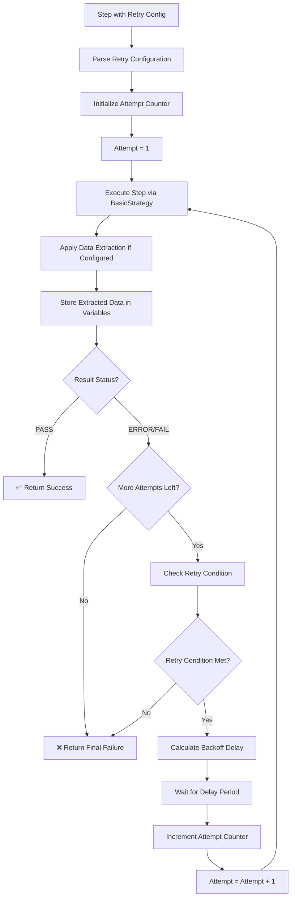
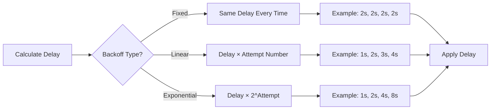
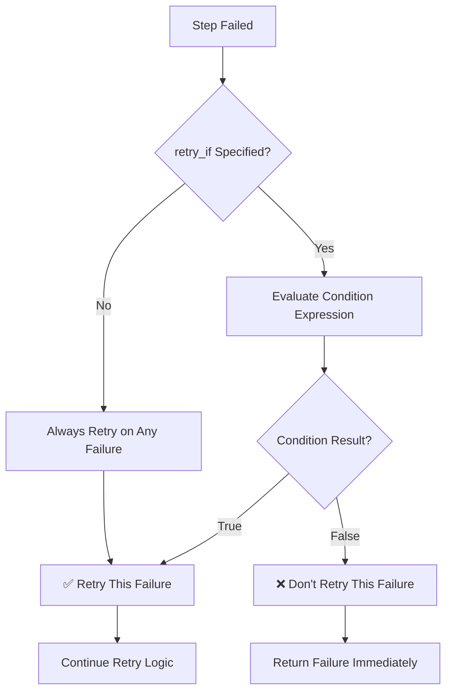
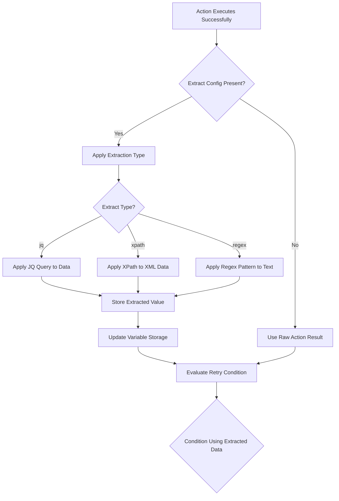

# Retry Logic Flow

This diagram shows how Robogo's retry mechanism works with different backoff strategies. The retry system provides resilience for flaky operations like network requests, database connections, and external API calls.

## Retry Execution Process

### **Main Retry Flow**



### **Backoff Strategy Calculation**



### **Retry Condition Evaluation**



## Retry Configuration Examples

### **Fixed Delay Retry**
```yaml
- name: "Reliable database connection"
  action: postgres
  args: ["query", "${db_url}", "SELECT 1"]
  retry:
    max_attempts: 3
    delay: "2s"
    backoff: "fixed"
  result: db_check

# Execution timeline:
# Attempt 1: Execute immediately
# Attempt 2: Wait 2s, then execute
# Attempt 3: Wait 2s, then execute
```

### **Exponential Backoff Retry**
```yaml
- name: "Flaky API endpoint"
  action: http
  args: ["GET", "${api_url}/unstable"]
  retry:
    max_attempts: 4
    delay: "1s"
    backoff: "exponential"
  result: api_response

# Execution timeline:
# Attempt 1: Execute immediately
# Attempt 2: Wait 1s, then execute
# Attempt 3: Wait 2s, then execute  
# Attempt 4: Wait 4s, then execute
```

### **Linear Backoff Retry**
```yaml
- name: "Rate-limited API"
  action: http
  args: ["POST", "${api_url}/limited"]
  retry:
    max_attempts: 5
    delay: "500ms"
    backoff: "linear"
  result: limited_response

# Execution timeline:
# Attempt 1: Execute immediately
# Attempt 2: Wait 500ms, then execute
# Attempt 3: Wait 1s, then execute
# Attempt 4: Wait 1.5s, then execute
# Attempt 5: Wait 2s, then execute
```

### **Conditional Retry**
```yaml
- name: "Retry only on server errors"
  action: http
  args: ["GET", "${api_url}/data"]
  retry:
    max_attempts: 3
    delay: "1s"
    backoff: "fixed"
    retry_if: "${response_status} >= 500"
  result: api_data

# Only retries if response status is 500, 501, 502, 503, etc.
# Does NOT retry on 4xx client errors (400, 401, 404, etc.)
```

## Data Extraction in Retry Logic

### **Extract Integration Process**

Data extraction occurs **after each action execution** but **before retry condition evaluation**. This allows retry decisions to be based on specific extracted values rather than just success/failure status.



### **Extract Types and Usage**

**1. JQ Extraction (JSON Data)**
```yaml
extract:
  type: "jq"
  path: ".response.status"        # Extract status field
  path: ".data | length"          # Get array length
  path: ".body | fromjson | .id"  # Parse JSON string then extract
```

**2. XPath Extraction (XML Data)**
```yaml
extract:
  type: "xpath"
  path: "//user/@id"              # Extract attribute value
  path: "//status/text()"         # Extract text content
  path: "count(//items/item)"     # Count elements
```

**3. Regex Extraction (Text Data)**
```yaml
extract:
  type: "regex"
  path: "Status: (\\w+)"          # Extract status word
  group: 1                        # Use capture group 1 (default)
  path: "Error: (.+)"             # Extract error message
```

### **Retry + Extract Examples**

**Example 1: API Readiness Check**
```yaml
- name: "Wait for API to be ready"
  action: http
  args: ["GET", "${api_url}/health"]
  extract:
    type: "jq"
    path: ".status"
  result: health_status
  retry:
    max_attempts: 10
    delay: "5s"
    backoff: "fixed"
    retry_if: "${health_status} != 'healthy'"

# Execution flow:
# 1. HTTP GET /health → {"status": "initializing", "uptime": 30}
# 2. Extract .status → "initializing"
# 3. Store in health_status variable
# 4. Evaluate: "initializing" != "healthy" → true
# 5. Wait 5s and retry
# 6. HTTP GET /health → {"status": "healthy", "uptime": 90}
# 7. Extract .status → "healthy"  
# 8. Evaluate: "healthy" != "healthy" → false
# 9. Success - no more retries needed
```

**Example 2: Database Record Count**
```yaml
- name: "Wait for data processing completion"
  action: postgres
  args: ["query", "${db_url}", "SELECT COUNT(*) as processed FROM jobs WHERE status='completed'"]
  extract:
    type: "jq"
    path: ".rows[0].processed"
  result: completed_count
  retry:
    max_attempts: 20
    delay: "10s"
    backoff: "linear"
    retry_if: "${completed_count} < 100"

# Waits until at least 100 jobs are completed before proceeding
```

**Example 3: Log File Analysis**
```yaml
- name: "Wait for specific log entry"
  action: file_read
  args: ["/var/log/application.log"]
  extract:
    type: "regex"
    path: ".*STARTUP_COMPLETE.*timestamp:(\\d+)"
    group: 1
  result: startup_timestamp
  retry:
    max_attempts: 30
    delay: "2s"
    backoff: "fixed"
    retry_if: "${startup_timestamp} == ''"

# Retries until the log contains STARTUP_COMPLETE message with timestamp
```

## Retry Logic Implementation Details

### **Retry Configuration Structure**
```go
type RetryConfig struct {
    MaxAttempts int           `yaml:"max_attempts"`         // Maximum retry attempts
    Delay       string        `yaml:"delay"`               // Initial delay (e.g., "1s", "500ms")
    Backoff     BackoffType   `yaml:"backoff,omitempty"`   // Backoff strategy
    RetryIf     string        `yaml:"retry_if,omitempty"`  // Condition for retrying
}

type BackoffType string
const (
    BackoffFixed       BackoffType = "fixed"       // Same delay every time
    BackoffLinear      BackoffType = "linear"      // Linearly increasing delay
    BackoffExponential BackoffType = "exponential" // Exponentially increasing delay
)
```

### **Backoff Calculation Logic**
```go
func calculateDelay(baseDelay time.Duration, attempt int, backoffType BackoffType) time.Duration {
    switch backoffType {
    case BackoffFixed:
        return baseDelay
    case BackoffLinear:
        return baseDelay * time.Duration(attempt)
    case BackoffExponential:
        return baseDelay * time.Duration(math.Pow(2, float64(attempt-1)))
    default:
        return baseDelay
    }
}
```

### **Retry Condition Evaluation**
```go
func shouldRetry(step types.Step, result *types.StepResult) bool {
    // If no retry_if condition specified, retry all failures
    if step.Retry.RetryIf == "" {
        return result.Status == constants.ActionStatusError || 
               result.Status == constants.ActionStatusFailed
    }
    
    // Evaluate the retry_if condition
    return evaluateCondition(step.Retry.RetryIf, variables)
}
```

## Common Retry Patterns

### **Database Connection Retry**
```yaml
# Handle temporary database unavailability
- name: "Connect to database with retry"
  action: postgres
  args: ["query", "${db_url}", "SELECT version()"]
  retry:
    max_attempts: 5
    delay: "2s"
    backoff: "exponential"
  result: db_version
```

### **HTTP API Retry with Rate Limiting**
```yaml
# Handle rate limits and temporary failures
- name: "API call with smart retry"
  action: http
  args: ["POST", "${api_url}/process", "${data}"]
  retry:
    max_attempts: 4
    delay: "1s"
    backoff: "linear"
    retry_if: "${response_status} == 429 || ${response_status} >= 500"
  result: process_result
```

### **Message Queue Retry**
```yaml
# Handle temporary messaging system issues
- name: "Publish message with retry"
  action: kafka
  args: ["publish", "${kafka_broker}", "events", "${event_data}"]
  retry:
    max_attempts: 3
    delay: "500ms"
    backoff: "fixed"
  result: publish_status
```

### **File Transfer Retry**
```yaml
# Handle network issues during file transfer
- name: "Upload file with retry"
  action: scp
  args: ["upload", "${ssh_host}:/remote/path", "${local_file}"]
  retry:
    max_attempts: 3
    delay: "5s"
    backoff: "exponential"
  result: upload_result
```

## Error Handling in Retry Logic

### **Maximum Attempts Reached**
When all retry attempts are exhausted, the final result contains:

```go
// Final result after all retries failed
StepResult{
    Status:   constants.ActionStatusError, // or ActionStatusFailed
    Message:  "Operation failed after 3 attempts: final error message",
    Duration: totalDurationIncludingRetries,
    Data:     lastAttemptData,
}
```

### **Retry Configuration Errors**
Invalid retry configurations result in immediate errors:

```yaml
# Invalid configuration examples
retry:
  max_attempts: 0        # Error: must be > 0
  delay: "invalid"       # Error: invalid duration format
  backoff: "unknown"     # Error: unknown backoff type
```

### **Retry Condition Errors**
Invalid `retry_if` expressions result in immediate errors:

```yaml
retry:
  retry_if: "${invalid_syntax"  # Error: malformed expression
  retry_if: "${undefined_var}"  # Error: undefined variable
```

## Performance Considerations

### **Total Execution Time**
Retry logic can significantly extend step execution time:

```yaml
# Example timing for exponential backoff
retry:
  max_attempts: 4
  delay: "1s"
  backoff: "exponential"

# Worst case timing:
# Attempt 1: 0s (immediate)
# Attempt 2: 1s delay + execution time
# Attempt 3: 2s delay + execution time  
# Attempt 4: 4s delay + execution time
# Total: ~7s + (4 × execution time)
```

### **Resource Usage**
- **Memory**: Minimal overhead, retry state is simple
- **CPU**: Negligible during delay periods
- **Network**: Proportional to number of attempts

### **Best Practices**
1. **Reasonable Limits**: Keep `max_attempts` under 10 for most use cases
2. **Appropriate Delays**: Start with short delays (500ms-2s) for network operations
3. **Smart Conditions**: Use `retry_if` to avoid retrying permanent failures
4. **Exponential Backoff**: Use for external APIs to avoid overwhelming services
5. **Fixed Delays**: Use for internal services with known recovery times

## Integration with Other Features

### **Retry + Conditional Execution**
```yaml
- name: "Retry database connection in production only"
  action: postgres
  args: ["query", "${db_url}", "SELECT 1"]
  if: "${ENV:ENVIRONMENT} == production"
  retry:
    max_attempts: 3
    delay: "2s"
    backoff: "exponential"
```

### **Retry + Security Settings**
```yaml
- name: "Retry authentication with logging suppressed"
  action: http
  args: ["POST", "/auth", '{"password": "${secret}"}']
  no_log: true
  retry:
    max_attempts: 2
    delay: "1s"
    backoff: "fixed"
  result: auth_response
```

### **Retry + Nested Steps**
```yaml
- name: "Retry entire workflow"
  retry:
    max_attempts: 3
    delay: "5s"
    backoff: "linear"
  steps:
    - name: "Step 1"
      action: http
      args: ["POST", "/create", "${data}"]
      result: created_id
      
    - name: "Step 2"  
      action: http
      args: ["PUT", "/configure/${created_id}", "${config}"]
```

### **Retry + Data Extraction**
```yaml
- name: "Retry with data extraction and conditional logic"
  action: http
  args: ["GET", "${api_url}/status"]
  extract:
    type: "jq"
    path: ".body | fromjson | .status"
  result: api_status
  retry:
    max_attempts: 5
    delay: "2s"
    backoff: "exponential"
    retry_if: "${api_status} != 'ready'"

# Execution flow:
# 1. Retry (Priority 3) → BasicExecution
# 2. HTTP action executes → returns raw response
# 3. Extract applies jq to extract .status field from response
# 4. Extracted value stored in api_status variable
# 5. retry_if condition evaluates using extracted api_status
# 6. If condition true, wait delay and retry entire process

# Real-world example from examples/27-retry-extraction-fixed.yaml
- name: "Wait for specific author in JSON response"
  action: http
  args: ["GET", "http://localhost:8000/json"]
  extract:
    type: "jq"
    path: ".body | fromjson | .slideshow.author"
  result: author
  retry:
    attempts: 3
    delay: "6s"
    retry_if: "${author} != 'Yours Truly'"
```

This retry system provides robust failure recovery while maintaining the simplicity and clarity of the KISS architecture, allowing tests to handle transient failures gracefully without manual intervention. The extract functionality enables intelligent retry decisions based on specific data fields rather than just success/failure status.