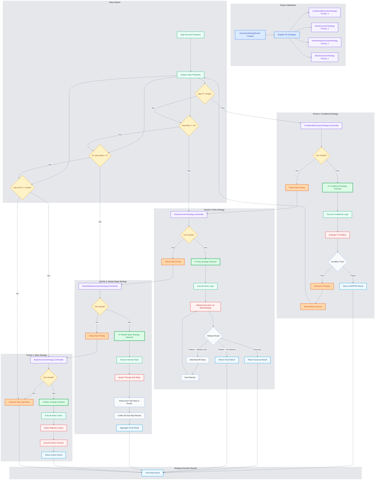

# Strategy Selection Logic

This diagram shows how the ExecutionStrategyRouter determines which execution strategy handles each step. The priority-based routing system is core to Robogo's flexible execution model, supporting conditional logic, retry mechanisms, nested steps, and basic actions.

## Strategy Selection Process



## Strategy Priority System

### **Priority Hierarchy (Highest to Lowest)**

1. **Priority 4: Conditional Execution** - `if` property handling
2. **Priority 3: Retry Logic** - `retry` configuration handling  
3. **Priority 2: Nested Steps** - `steps` array handling
4. **Priority 1: Basic Execution** - Simple `action` execution

**Key Principle**: Higher priority strategies handle more specific execution patterns, while lower priority strategies provide fallback behavior.

## Strategy Selection Logic

### **1. ConditionalExecutionStrategy (Priority 4)**

**Condition Check:**
```go
func (s *ConditionalExecutionStrategy) CanHandle(step types.Step) bool {
    return step.If != ""  // Step has conditional logic
}
```

**YAML Examples:**
```yaml
# Conditional execution based on variable
- name: "Create user if not exists"
  action: http
  args: ["POST", "/users", "${user_data}"]
  if: "${user_exists} == false"
  result: create_response

# Conditional execution based on environment  
- name: "Run in production only"
  action: http
  args: ["POST", "/production-endpoint"]
  if: "${ENV:ENVIRONMENT} == production"
```

**Execution Flow:**
1. **Evaluate Condition**: Parse and evaluate `if` expression
2. **True**: Remove `if` property and route back to router for normal execution
3. **False**: Return `SKIPPED` status without executing step

### **2. RetryExecutionStrategy (Priority 3)**

**Condition Check:**
```go
func (s *RetryExecutionStrategy) CanHandle(step types.Step) bool {
    return step.Retry != nil  // Step has retry configuration
}
```

**YAML Examples:**
```yaml
# Fixed delay retry
- name: "Flaky API call"
  action: http
  args: ["GET", "${unreliable_endpoint}"]
  retry:
    max_attempts: 3
    delay: "2s"
    backoff: "fixed"
  result: api_response

# Exponential backoff retry
- name: "Database connection"
  action: postgres
  args: ["query", "${db_url}", "SELECT 1"]
  retry:
    max_attempts: 5
    delay: "1s"
    backoff: "exponential"

# Conditional retry
- name: "HTTP request with server error retry"
  action: http
  args: ["GET", "/api/data"]
  retry:
    max_attempts: 4
    delay: "500ms"
    retry_if: "${response_status} >= 500"
```

**Execution Flow:**
1. **Attempt Execution**: Use BasicExecutionStrategy for actual execution
2. **Check Result**: Evaluate success/failure
3. **Retry Decision**: Based on attempts left and retry conditions
4. **Backoff Calculation**: Apply delay strategy (fixed, linear, exponential)
5. **Final Result**: Return success or final failure after all attempts

### **3. NestedStepsExecutionStrategy (Priority 2)**

**Condition Check:**
```go
func (s *NestedStepsExecutionStrategy) CanHandle(step types.Step) bool {
    return len(step.Steps) > 0  // Step contains nested steps
}
```

**YAML Examples:**
```yaml
# Grouped related operations
- name: "User registration workflow"
  steps:
    - name: "Validate email format"
      action: assert
      args: ["${email}", "contains", "@"]
      
    - name: "Create user account"
      action: http
      args: ["POST", "/users", "${user_data}"]
      result: user_response
      
    - name: "Send welcome email"
      action: http
      args: ["POST", "/email/welcome", "${email_data}"]

# Database transaction simulation
- name: "Update user and log action"
  steps:
    - name: "Update user record"
      action: postgres
      args: ["execute", "${db_url}", "UPDATE users SET last_login = NOW() WHERE id = ${user_id}"]
      
    - name: "Log access event"
      action: postgres
      args: ["execute", "${db_url}", "INSERT INTO access_log (user_id, timestamp) VALUES (${user_id}, NOW())"]
```

**Execution Flow:**
1. **Iterate Sub-Steps**: Process each step in the `steps` array
2. **Route Each Step**: Send each sub-step back to the router for strategy selection
3. **Collect Results**: Gather results from all sub-step executions  
4. **Aggregate**: Combine into single result (PASS if all pass, FAIL/ERROR on first failure)

### **4. BasicExecutionStrategy (Priority 1)**

**Condition Check:**
```go
func (s *BasicExecutionStrategy) CanHandle(step types.Step) bool {
    return step.Action != ""  // Step has an action to execute
}
```

**YAML Examples:**
```yaml
# Simple HTTP request
- name: "Get user data"
  action: http
  args: ["GET", "/users/123"]
  result: user_data

# Database query
- name: "Check user count"
  action: postgres
  args: ["query", "${db_url}", "SELECT COUNT(*) FROM users"]
  result: user_count

# Assertion
- name: "Verify response code"
  action: assert
  args: ["${status_code}", "==", "200"]
```

**Execution Flow:**
1. **Action Lookup**: Find action function in ActionRegistry
2. **Variable Substitution**: Resolve all `${variable}` patterns in arguments
3. **Security Processing**: Apply `no_log` and `sensitive_fields` settings
4. **Action Execution**: Call action function with processed arguments
5. **Result Storage**: Store result in variables if `result` property specified

## Strategy Combination Examples

### **Conditional + Retry**
```yaml
- name: "Retry database connection in production only"
  action: postgres
  args: ["query", "${db_url}", "SELECT version()"]
  if: "${ENV:ENVIRONMENT} == production"
  retry:
    max_attempts: 3
    delay: "1s"
    backoff: "exponential"
  result: db_version

# Execution: Conditional (Priority 4) → removes 'if' → Router → Retry (Priority 3) → BasicExecution
```

### **Conditional + Nested Steps**
```yaml
- name: "Setup test environment if needed"
  if: "${ENV:SETUP_REQUIRED} == true"
  steps:
    - name: "Create test database"
      action: postgres
      args: ["execute", "${db_url}", "CREATE DATABASE testdb"]
      
    - name: "Load test data"
      action: postgres
      args: ["execute", "${db_url}", "INSERT INTO users (name) VALUES ('testuser')"]

# Execution: Conditional (Priority 4) → removes 'if' → Router → NestedSteps (Priority 2) → each sub-step → Router → BasicExecution
```

### **Retry + Nested Steps**
```yaml
- name: "Reliable multi-step operation"
  retry:
    max_attempts: 3
    delay: "2s"
  steps:
    - name: "Step 1: Create resource"
      action: http
      args: ["POST", "/resources", "${resource_data}"]
      result: resource_id
      
    - name: "Step 2: Configure resource"
      action: http
      args: ["PUT", "/resources/${resource_id}/config", "${config_data}"]

# Execution: Retry (Priority 3) → NestedSteps (Priority 2) → each sub-step → Router → BasicExecution
# If any sub-step fails, entire nested operation is retried
```

## Router Implementation Details

### **Strategy Registration**
```go
func NewExecutionStrategyRouter(/* dependencies */) *ExecutionStrategyRouter {
    router := &ExecutionStrategyRouter{
        strategies: make([]StrategyWithPriority, 0),
    }
    
    // Register strategies in priority order (highest first)
    router.RegisterStrategy(&ConditionalExecutionStrategy{}, 4)
    router.RegisterStrategy(&RetryExecutionStrategy{}, 3)
    router.RegisterStrategy(&NestedStepsExecutionStrategy{}, 2)
    router.RegisterStrategy(&BasicExecutionStrategy{}, 1)
    
    return router
}
```

### **Strategy Selection Algorithm**
```go
func (r *ExecutionStrategyRouter) Execute(step types.Step, stepNumber int, loopContext *types.LoopContext) *types.StepResult {
    // Sort strategies by priority (highest first)
    sort.Slice(r.strategies, func(i, j int) bool {
        return r.strategies[i].Priority > r.strategies[j].Priority
    })
    
    // Find first strategy that can handle the step
    for _, strategyWithPriority := range r.strategies {
        if strategyWithPriority.Strategy.CanHandle(step) {
            return strategyWithPriority.Strategy.Execute(step, stepNumber, loopContext)
        }
    }
    
    // No strategy can handle this step
    return createUnknownStepError(step)
}
```

## Error Handling in Strategy Selection

### **Unknown Step Type**
```yaml
# Invalid step - no action, no conditional, no retry, no nested steps
- name: "Invalid step"
  # Missing: action, if, retry, or steps
  args: ["some", "arguments"]

# Results in error: "No execution strategy can handle this step"
```

### **Strategy Execution Errors**
Each strategy handles its own execution errors:

- **ConditionalExecutionStrategy**: Invalid condition expressions
- **RetryExecutionStrategy**: Invalid retry configuration
- **NestedStepsExecutionStrategy**: Sub-step execution failures
- **BasicExecutionStrategy**: Unknown actions, argument validation errors

### **Circular Strategy Routing**
The router prevents infinite loops:
- **ConditionalExecutionStrategy**: Routes back to router only after removing `if` property
- **NestedStepsExecutionStrategy**: Routes sub-steps to router, not self
- **RetryExecutionStrategy**: Uses BasicExecutionStrategy directly, doesn't route back

## Performance Characteristics

### **Strategy Selection Performance**
- **O(1) Average Case**: Most steps handled by BasicExecutionStrategy (Priority 1)
- **O(n) Worst Case**: n = number of strategies (currently 4, so effectively O(1))
- **Priority Sorting**: Done once during router creation, not per step

### **Memory Usage**
- **Strategy Instances**: Single instance per strategy type, shared across all executions
- **No Dynamic Allocation**: Strategies registered at startup, not created per step
- **Minimal Overhead**: Router adds minimal memory overhead per step execution

### **Execution Paths**
- **Most Common**: BasicExecutionStrategy (simple actions)
- **Conditional**: ConditionalExecutionStrategy → Router → BasicExecutionStrategy
- **Complex**: Multiple strategy combinations as shown in examples

This strategy selection system provides the flexibility for complex execution patterns while maintaining the simplicity of the KISS architecture through clear priority-based routing and single-responsibility strategies.