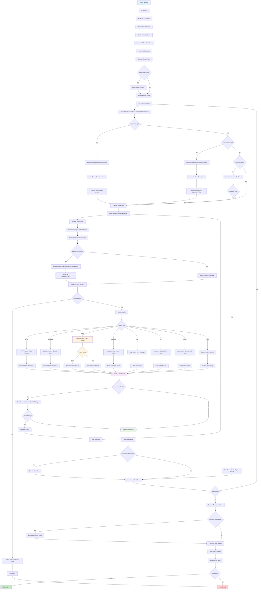

# Robogo Test Execution Flow

This diagram shows how a test case flows through the Robogo framework, from YAML parsing to final results.



## Key Components

### **Entry Points**
- **CLI Parser**: Handles command-line arguments and routes to appropriate handlers
- **TestRunner**: Main orchestrator that loads and executes tests

### **Control Flow Management**
- **ControlFlowExecutor**: Main coordinator for step execution
- **LoopExecutor**: Handles for/while loop execution
- **ConditionEvaluator**: Evaluates if/while conditions

### **Variable System**
- **VariableStore**: Core storage for variables
- **SubstitutionEngine**: Processes simple ${variable} templates
- **Data Extraction**: Uses `jq` for JSON/structured data, `xpath` for XML
- **ErrorAnalyzer**: Provides hints to use `jq`/`xpath` for complex access

### **Action Execution**
- **Action Registry**: Maps action names to implementations
- **StepExecutor**: Core step execution without retry
- **RetryExecutor**: Handles retry logic with backoff strategies

### **Result Handling**
- **ActionResult**: Standardized result format
- **StepResult**: Complete step execution result
- **TestResult**: Final test outcome with summary

## Execution Patterns

### **Test with Setup/Teardown**
```yaml
testcase: "User Management Test"
setup:
  - name: "Create test database"
    action: postgres
    args: ["execute", "${db_url}", "CREATE TABLE test_users..."]

steps:
  - name: "Test user creation"
    action: log
    args: ["Running main test..."]

teardown:
  - name: "Clean up test data"
    action: postgres
    args: ["execute", "${db_url}", "DROP TABLE test_users"]
```
Flow: CLI → TestRunner → Setup Phase → Main Steps → Teardown Phase → Results

### **Simple Step**
```yaml
- name: "Log message"
  action: log
  args: ["Hello World"]
```
Flow: CLI → TestRunner → ControlFlow → StepExecutor → Log Action → Result

### **Step with Variables & Data Extraction**
```yaml
- name: "HTTP Request"
  action: http
  args: ["GET", "${base_url}/api/users"]
  result: users_response

- name: "Extract user count"
  action: jq
  args: ["${users_response}", ".body | fromjson | length"]
  result: user_count
```
Flow: CLI → TestRunner → ControlFlow → Variable Substitution → HTTP Action → Store Result → jq Action → Extract Data

### **Step with Loops**
```yaml
- name: "Process each user"
  action: log
  args: ["Processing user ${item}"]
  for: "[alice,bob,charlie]"
```
Flow: CLI → TestRunner → ControlFlow → LoopExecutor → (3x Step Execution) → Results

### **Step with Retry**
```yaml
- name: "Flaky API call"
  action: http
  args: ["GET", "${api_url}"]
  retry:
    attempts: 3
    delay: "1s"
    backoff: "exponential"
```
Flow: CLI → TestRunner → ControlFlow → RetryExecutor → (Up to 3x HTTP Action) → Final Result
