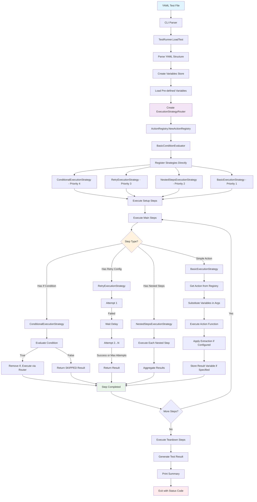

# Robogo Test Execution Flow

This diagram shows how a test case flows through the simplified Robogo framework architecture.



## Architecture Overview

### Core Components

1. **CLI**: Direct command-line interface handling `run`, `list`, `version` commands
2. **TestRunner**: Orchestrates test execution lifecycle with direct strategy router
3. **ExecutionStrategyRouter**: Priority-based routing to appropriate execution strategy
4. **Variables**: Simple map-based variable storage with substitution (no complex abstractions)
5. **Strategy Pattern**: Clean execution routing for different step types

### Execution Strategies (Priority Order)

1. **ConditionalExecutionStrategy** (Priority 4): Handles `if` conditions
2. **RetryExecutionStrategy** (Priority 3): Handles `retry` configuration  
3. **NestedStepsExecutionStrategy** (Priority 2): Handles `steps` arrays
4. **BasicExecutionStrategy** (Priority 1): Default fallback for simple actions

### Variable System

- **Simple Direct Approach**: Single `Variables` struct with map storage
- **Substitution**: `${variable}` and `${ENV:VARIABLE}` syntax
- **No Complex Abstractions**: Removed VariableManager, TemplateSubstitution layers

### Action System

- **ActionRegistry**: Instance-based action storage (no global state)
- **Direct Function Calls**: Actions are simple functions, no interfaces
- **Built-in Actions**: HTTP, Database (PostgreSQL, Spanner), Messaging (Kafka, RabbitMQ), etc.

## Example Flows

### Simple HTTP Test
```
CLI → TestRunner → ExecutionStrategyRouter → BasicExecutionStrategy → HTTP Action → Result
```

### Conditional Test with Retry
```
CLI → TestRunner → ExecutionStrategyRouter → ConditionalExecutionStrategy → 
RetryExecutionStrategy → BasicExecutionStrategy → Action → Result
```

### Nested Steps Test
```
CLI → TestRunner → ExecutionStrategyRouter → NestedStepsExecutionStrategy → 
(Multiple BasicExecutionStrategy calls) → Aggregated Result
```

## Key Simplifications Made

- **Removed**: VariableManager, TemplateSubstitution, ActionExecutor interface layers
- **Removed**: ControlFlowExecutor, StepExecutor, LoopExecutionStrategy dead code
- **Eliminated**: ExecutionPipeline, Dependencies, DependencyInjector, UnifiedExecutor abstraction layers
- **Simplified**: Direct Variables map instead of 4-layer abstraction
- **Direct Construction**: TestRunner directly creates and uses ExecutionStrategyRouter
- **Consolidated**: Strategy pattern handles all control flow (conditions, retry, nesting)
- **Maintained**: All functionality while removing ~1500+ lines of over-engineered code